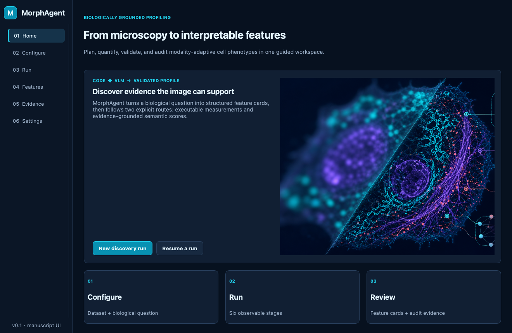

# MorphAgent

MorphAgent is an **automatic microscopy image feature extraction agent** built on large language models (LLMs) and multimodal vision-language models (VLMs). Given a batch of microscopy images and a one-sentence natural-language task description, it automatically:

1. **Understands the dataset** (dimensions, channels, markers, naming conventions);
2. **Automatically segments** cells / nuclei / cytoplasm and other structures (Cellpose-SAM, or Allen aicssegmentation);
3. **Plans features** (morphology, intensity, texture, distribution, spatial, and other categories);
4. Extracts scalar features via two complementary paths:
   - **Code features**: the LLM generates an `extract()` Python function that runs in an isolated sandbox environment, self-debugs, and executes in batch;
   - **VLM features**: a multimodal model scores images feature by feature (a continuous score of 0–100);
5. (Optional) injects external knowledge: **expert_knowledge** (expert materials), **auto_deep_research** (deep research reports), **auto_literature_retrieval / RAG** (literature corpus);
6. **Deterministically validates** and filters features, and outputs a feature table CSV.

> This repository is the **public, general-purpose build**: it accesses models only through an **OpenAI-compatible API** (**no local model deployment whatsoever**), and it contains no specific datasets, experiments, or paper-analysis code. You only need to prepare your own dataset and configure an API to run it on any microscopy dataset.

---

## Table of Contents

- [Key Features](#key-features)
- [Directory Structure](#directory-structure)
- [Environment & Installation](#environment--installation)
- [Configuration (API & Models)](#configuration-api--models)
- [Input Data Format (Important)](#input-data-format-important)
- [Graphical UI (fast path)](#graphical-ui-fast-path)
- [Quick Start](#quick-start)
- [Output](#output)
- [Auto Segmentation (auto_segmentation)](#auto-segmentation-auto_segmentation)
- [Auto Deep Research & Literature Retrieval](#auto-deep-research--literature-retrieval)
- [Common Command-Line Arguments](#common-command-line-arguments)
- [FAQ](#faq)

---

## Key Features

| Capability | Description | Dependencies |
|------|------|------|
| Code feature extraction | The LLM generates/repairs an `extract(img, seg)` function and runs it in batch | LLM API + sandbox conda environment |
| VLM feature scoring | A multimodal model scores images feature by feature on a continuous scale | Multimodal API (e.g. GPT-4o) |
| auto_segmentation | Generates masks with Cellpose-SAM (default) or Allen aicssegmentation | GPU (Cellpose) / CPU (Allen) |
| auto_deep_research | One API call writes a report into `deep_research/`, or reads your `.md/.txt/.pdf` -> LLM digests -> injects into planning | Deep-research/LLM API (PDF: lite text extract) |
| auto_literature_retrieval (RAG) | Downloads open-access PubMed PDFs into `RAG/` (or reads your `.xml/.pdf`) -> lite PDF text -> LLM digests -> injects into planning | Internet + pymupdf + LLM API |
| expert_knowledge | Reads expert materials under `expert_knowledge/` -> LLM digests | LLM API |
| Deterministic validation | Unsupervised / supervised (metadata) feature filtering with multi-round deduplication | None |

---

## Directory Structure

```
MorphAgent/
├── main.py                  # Main entry point (processes the whole dataset in batch)
├── launch_ui.py             # focused Qt launcher; optional napari mode
├── morphagent_ui/           # UI state, controller, theme, screens, and optional napari manifest
├── config.py                # Global configuration (USER CONFIGURATION block at the top)
├── graph.py / state.py      # LangGraph pipeline and state
├── utils_helpers.py         # Dataset indexing / image path lookup
├── nodes/                   # researcher -> prompt_gen -> execution nodes
├── tools/                   # Code generation/execution/repair, VLM client, segmentation calls
├── knowledge/               # Dataset understanding, expert/deep_research/RAG, prompts/
│   └── prompts/             # 6 general-purpose prompt templates (JSON)
├── utils/ utils_modules/    # Cell context, data preprocessing, channel parsing, reproducibility
├── validation/              # Deterministic feature validation and registry
├── segmentation_allen/      # Allen aicssegmentation backend (vendored + CLI entry point)
├── envs/                    # Environment yaml files (see "Environment & Installation")
├── .env.example             # Configuration template (copy to .env)
└── README.md
```

---

## Environment & Installation

This project has **no local large model**: all LLM/VLM calls go through an OpenAI-compatible API. The environment only needs to cover
agent orchestration, sandbox scientific computing, and Cellpose-SAM segmentation. Everything is merged into **one** unified environment.

- **`morphagent` (unified environment, Python 3.10)**: runs the main program (LangChain/LangGraph/OpenAI client), the sandbox that executes generated code (numpy/scipy/scikit-image/opencv/tifffile/mahotas, etc.), and **Cellpose-SAM** segmentation (cellpose ≥ 4.0 + PyTorch). For convenience, the agent, sandbox, and segmentation are merged into the same environment.
- **`morphagent_allen` (optional/legacy, Python 3.6)**: Allen `aicssegmentation` has older dependencies (scikit-image 0.15, numpy 1.19) that **cannot be merged with a modern environment**, so it must be created separately. The default Cellpose-SAM path does not use it at all.

Installation:

```bash
# 1) Unified main environment (recommended)
conda env create -f envs/environment.yml      # creates morphagent
conda activate morphagent

# Or: manage your own Python 3.10 environment (venv/pyenv/uv)
#   pip install -r envs/requirements.txt

# 2) Post-install self-check
python - <<'PY'
import langchain, langgraph, openai, cellpose, torch
import numpy, pandas, skimage, cv2, tifffile, mahotas, bs4
print("torch CUDA available:", torch.cuda.is_available())
print("cellpose:", cellpose.version); print("OK")
PY

# 3) (Optional) extra features such as PDF parsing / local VLM
#   pip install -r envs/requirements-optional.txt

# 3b) (Optional, recommended for desktop use) MorphAgent UI
pip install -e ".[ui]"

# 4) (Optional/legacy) Allen segmentation environment
conda env create -f envs/environment_allen.yml # creates morphagent_allen
conda activate morphagent_allen
pip install -e segmentation_allen              # installs vendored aicssegmentation
python segmentation_allen/check_installation.py
export SEGMENTATION_CONDA_ENV=morphagent_allen # make the main program use the Allen segmentation backend
```

> See `envs/README.md` for details.

---

## Configuration (API & Models)

There are two ways (you **must explicitly specify the model name to use**):

**Option A: Environment variables (recommended, keeps keys out of the repo)**

```bash
cp .env.example .env      # edit .env and fill in your values
source .env               # only needed for direct `python main.py` CLI runs

export LLM_BASE_URL="https://api.openai.com/v1"
export LLM_API_KEY="sk-..."
export LLM_MODEL="gpt-4o"          # text model used for planning/writing code/review

export VLM_BASE_URL="https://api.openai.com/v1"
export VLM_API_KEY="sk-..."
export VLM_MODEL="gpt-4o"          # multimodal (vision) model used for scoring
```

**Option B: Edit `config.py` directly**

Open the `USER CONFIGURATION` block at the top of `config.py` and change the default values of `DEFAULT_LLM_*` / `DEFAULT_VLM_*` to your own.

> Any service that implements the OpenAI Chat Completions protocol will work: OpenAI, Azure OpenAI, DeepSeek, Together, OpenRouter, or a self-hosted gateway (vLLM / Ollama / LM Studio). If a gateway requires custom HTTP headers, set them in `DEFAULT_LLM_HEADERS` / `DEFAULT_VLM_HEADERS` in `config.py`.

To temporarily switch endpoints, register a named preset in `API_PROVIDER_PRESETS` in `config.py` and select it at runtime with `--api-provider <name>`.

---

## Input Data Format (Important)

MorphAgent makes **very general** assumptions about the data layout: **one dataset = one directory, in which each subdirectory is one sample**. Details below.

### 1. Top-level layout

The directory you point `--data-root` at (denoted `INPUT`) can be one of two forms, and the program will recognize them automatically:

```
# Form 1: INPUT is directly the dataset root
INPUT/                         # == data_root
├── dataset_index.txt          # dataset description file (see below)
├── sample_0001/               # one sample = one subdirectory
├── sample_0002/
└── ...

# Form 2: INPUT is the project root, containing a dataset/ subdirectory (recommended, allows knowledge folders)
INPUT/                         # == project_root
├── dataset/                   # == data_root (auto-detected)
│   ├── dataset_index.txt
│   ├── sample_0001/
│   └── ...
├── expert_knowledge/          # optional
├── deep_research/             # optional
└── RAG/                       # optional
```

- **Sample ID = subdirectory name**: `read_dataset_index()` directly scans all non-hidden subdirectories under `data_root` as the sample list, and **does not rely on any manifest inside an index file**. The directory name is the sample ID (processed in sorted order).
- If a `dataset/` directory exists under `INPUT`, then `data_root=INPUT/dataset` and `project_root=INPUT`; otherwise `data_root=INPUT` and `project_root` is the parent directory of `INPUT`. Knowledge folders (`expert_knowledge/`, `deep_research/`, `RAG/`) always live under **project_root**.

### 2. Inside each sample directory

```
sample_0001/
├── image.tif                  # (1) primary file (raw data), used by Code features
├── ...(there may be multiple primary image files)
├── slices/                    # (2) secondary directory (derived data), preferred by VLM features
│   ├── slice_0000_channel_0.png
│   └── ...
└── segmentation/              # (3) segmentation masks (auto-generated by this tool, or bring your own)
    ├── mask_cell.tif
    ├── mask_nucleus.tif
    └── ...
```

- **(1) Primary files (primary)**: image files **directly** under the sample directory (excluding subdirectories). These are the input for **Code features** (the `img` in `extract(img, ...)`). Supports `.tif/.tiff/.png/.jpg/.jpeg/.bmp/.gif`. The generated code chooses the reading method by extension (tifffile for TIFF, PIL for PNG/JPG).
- **(2) Secondary directories (secondary)**: image files inside subdirectories of the sample directory (e.g. `slices/*.png`). **VLM features** prefer these 2D slices that are easy to view visually; if none exist, they fall back to the primary files. These slices can be generated automatically by this tool's preprocessing stage (normalized slices for multi-channel/z-stack data), or you can bring your own.
- **(3) `segmentation/`**: the segmentation mask directory (see the next section).

### 3. Segmentation masks and the `seg` dictionary (key point)

The generated Code feature function signature is:

```python
def extract(img, seg):   # when segmentation is available
def extract(img):        # when there is no segmentation
```

Here **`seg` is a dictionary** whose keys are the **file name stems** of the mask files under the `segmentation/` directory:

| File | Key in `seg` | Typical meaning |
|------|-------------|----------|
| `segmentation/mask_cell.tif` | `seg["mask_cell"]` | whole cell |
| `segmentation/mask_nucleus.tif` | `seg["mask_nucleus"]` | nucleus |
| `segmentation/cyto.tif` | `seg["cyto"]` | Cellpose-SAM whole-cell instance labels |
| `segmentation/nuclei.tif` | `seg["nuclei"]` | Cellpose-SAM nucleus instance labels |

- The code **always accesses masks by key name** (`seg.get("mask_cell")`), never by positional index — different datasets have different mask names/counts.
- A mask can be binary (0/background) or an instance label map (multiple integer labels); the generated code processes objects using `regionprops` and similar tools.
- **You can bring your own segmentation**: just place masks into each sample's `segmentation/` directory, and by default (`--segmentation-skip-if-present`) the program will skip auto-segmentation and use your masks directly.

### 4. Dataset description file (description)

Placed under `data_root` and located by priority: `dataset_index.txt` -> `README.md` -> `README.txt` -> `dataset_description.json` -> `description.txt` (you can also specify the path explicitly with `--description`).

It is **free text** handed to the LLM to understand, telling the agent about: the data dimensions (2D/3D/multi-channel/z-stack), what each channel captures (markers/colors), file naming conventions, etc. The clearer it is written, the more accurate the feature planning. Example:

```
Dataset: my_microscopy
Dimension: 2D multi-channel (C, H, W), 3 channels
Channels:
  Channel 0 | Red   | Actin (F-actin)
  Channel 1 | Green | Tubulin
  Channel 2 | Blue  | DAPI (nucleus)
File layout: each sample folder contains one multi-channel TIFF `image.tif`.
Notes: single cell per image; pixel size ~0.65 um.
```

> The description file **only affects understanding and planning**; it does not determine the sample list (the sample list comes from scanning subdirectories).

### 5. Optional knowledge folders (placed under project_root)

| Folder | What to put in | How it is used |
|--------|--------|-----------|
| `expert_knowledge/` | Expert notes, example images, review PDFs (`.txt/.md/.csv/.json/.pdf/images`) | The LLM digests them into expert knowledge blocks and injects them into planning |
| `deep_research/` | Deep research reports (**`.md/.txt` recommended**; `.pdf` also supported) | The LLM digests them into a research summary and injects it into planning |
| `RAG/` | Literature corpus (PMC `.xml`; `.pdf` also supported), placed flat at the top level of this directory | The LLM digests them in batch into literature knowledge and injects it into planning (with hash caching) |

- These are all **optional** and can be turned off with `--disable-expert-knowledge` / `--disable-deep-research` / `--disable-rag`.
- You can populate `deep_research/` and `RAG/` **automatically** with `--auto-deep-research` and `--auto-literature-retrieval` (see [Auto Deep Research & Literature Retrieval](#auto-deep-research--literature-retrieval)).
- PDFs use lightweight PyMuPDF text extract by default (optional PaddleX via `RAG_PDF_BACKEND=paddlex`); `.md/.txt/.xml` are read directly.

---

## Graphical UI (fast path)

The focused Qt workspace wraps the existing `main.py` pipeline without duplicating its scientific logic. It has five destinations—Home, Configure, Run, Features, and Evidence—with API setup merged into Configure. Home can load a completed run for result-only debugging or open **Ask MorphAgent**, a paper-and-code companion that does not add another workflow destination to the sidebar. Features uses an equal-width table/detail layout; Evidence uses an equal-width review layout with a three-column feature selector and a compact name/description summary beside curated measurements, validation, provenance, and image previews. The default evidence preview opens the first curated source rather than prioritizing an image. The MorphAgent window opens maximized by default and contains no empty napari canvas or layer-control panel.



```bash
conda activate morphagent
pip install -e ".[ui]"             # first UI launch only
python launch_ui.py                 # automatically reads the repository .env
```

If you specifically need napari layers and its microscopy canvas, install and request that mode explicitly:

```bash
pip install -e ".[napari]"
python launch_ui.py --with-napari
```

The repository includes the Tau-neuron reference workflow under
[`demo/`](demo/). Its **10 samples** (`WT_1`–`WT_5` wild-type, `MU_1`–`MU_5` mutant) already contain images,
VLM slices, and segmentation masks per sample; its precomputed RAG digest also
avoids reparsing the bundled PDFs. The shortest verified path is:

1. Open **Configure** and select **Load demo dataset**.
2. Confirm the Tau aggregation question, then complete **Model API**. Leave **Use the same connection for image scoring** unchecked unless LLM and VLM share one endpoint.
3. Select the analysis route and knowledge sources, then press **Run MorphAgent**. Demo scale is **1 round × 5 candidates · target 5** (open **Config** for advanced knobs). Masks are reused when present; missing masks use Allen when available. A 1-round demo run typically takes about **5–30 minutes**, depending on model response speed.
4. Follow **Live run**: Inspect -> Prepare -> Plan -> Quantify -> Validate -> Export. Completed files remain in the run directory after cancellation or failure.
5. Open **Features** to inspect and filter the feature cards. Open **Evidence** to choose a feature independently and inspect its measurements, validation decisions, and provenance. Shared run-level preview folders are not shown as per-feature images.

During UI/result debugging, choose **Load a previous run** on Home and select the specific completed `run_ui_*` results folder. MorphAgent loads Features and Evidence directly without launching `main.py`, making API calls, or rerunning segmentation and feature extraction.

### Ask MorphAgent paper companion

Choose **Ask MorphAgent** on Home, enter an OpenAI Chat Completions–compatible Base URL, API key, and text model, then select **Continue to chat**. The chat retrieves relevant excerpts from the bundled manuscript, supplementary material, algorithm/prompt assets, and a sanitized snapshot of first-party source code before each answer. It is designed to explain contributions, evidence, implementation, figures, and limitations positively but must not invent results or hide documented limitations. Answers include source labels such as `[Manuscript]`, `[Supplementary]`, and `[Code: ...]`.

The same repository-local `.env` fields used by Configure (`LLM_BASE_URL`, `LLM_API_KEY`, and `LLM_MODEL`) are reused. The key remains masked and is never inserted into the knowledge bundle or conversation. Relevant paper/code excerpts and the reviewer’s question are sent to the configured provider; therefore reviewers should use a provider permitted to receive manuscript text. Chat history is kept only in memory for the current UI session.

To use another dataset, select its project root or `dataset/` directory, scan it,
and write a new biological question instead of loading the reference demo.

The **Model API** section reads and safely updates the repository-local `.env`, which is excluded by `.gitignore`. Saved keys are never displayed again, copied into commands, written to run manifests, or printed in logs; leaving a key field blank preserves the existing value. No `source` or terminal exports are required for UI launches. Low-frequency controls such as candidate count, rounds, route ratio, workers, and concurrency also live in `.env` instead of occupying a separate Settings page. Keep `LLM_MAX_TOKENS` and `MERGE_MAX_TOKENS` within the selected provider's limits; the reference gateway was verified at `16384`. For generated-code and segmentation safeguards, resume semantics, and output details, see [docs/UI_GUIDE.md](docs/UI_GUIDE.md).

See the [reference demo guide](demo/README.md) or run the [reference notebook](demo/morphagent_demo.ipynb) for the same configuration without the graphical interface.

---

## Quick Start

```bash
conda activate morphagent
source .env    # API/models already configured

python main.py "Generate unbiased morphological features for these microscopy images" \
  --data-root /path/to/INPUT \
  --method both \
  --features-per-iteration 10 \
  --target-feature-count 200
```

- The positional argument is the **natural-language task description** (it feeds into the feature planning prompt).
- `--method both`: use both code and vlm; you can also use `code` or `vlm`.
- The first run automatically: understands the dataset -> (optionally) segments -> plans features -> generates/executes code + VLM scoring -> validates -> writes CSV.

---

## Output

By default, results are written to `<project_root>/results/run_<timestamp>/` (can be set with `--results-dir`):

| File | Meaning |
|------|------|
| `features.csv` | All extracted features (rows = samples, columns = features) |
| `retained_features.csv` | Features retained after deterministic validation |
| `feature_registry.json` | Feature registry (with metadata/decisions for each feature) |
| `feature_plan.json` | The list of features planned in this round |
| `dataset_description.txt` | The dataset understanding generated by the LLM |
| `expert_knowledge_summary.txt` / `deep_research_summary.txt` / `rag_knowledge_summary.txt` | Summaries of each knowledge source (if enabled) |
| `segmentation_summary.json` | Segmentation statistics (if enabled) |

---

## Auto Segmentation (auto_segmentation)

### Cellpose-SAM (default, integrated into the main pipeline)

Step 2.4 of the main program automatically segments all samples (requires a GPU). You can also call it separately:

```bash
# Single image
conda activate morphagent
python tools/segment_tif_with_cpsam.py input.tif -o sample_dir/segmentation/ -c 0 2

# Batch (Python API)
python -c "from tools.segmentation import segment_all_samples; ..."
```

This outputs `cyto.tif` / `nuclei.tif` / `cytoplasm.tif` to each sample's `segmentation/`. Use `--disable-segmentation` to turn it off.

### Allen aicssegmentation (optional, separate environment)

Good for classic nucleus/cytoplasm segmentation and fiber/mitochondria-like punctate structures. Requires the `morphagent_allen` environment (see `segmentation_allen/README_SEGMENTATION.md`):

```bash
conda activate morphagent_allen
# Nucleus + cytoplasm (TIFF)
python segmentation_allen/run_segment_image_tif.py input.tif -o out_dir/ -c 2 0 1
# Mitochondria / punctate structures
python segmentation_allen/run_segment_mitochondria.py input.tif -o out_dir/
# PNG batch
python segmentation_allen/segmentation_pipeline.py -d png_dir/ -o out_dir/
```

Place the generated masks into each sample's `segmentation/`, and the main pipeline will use them directly (skipping Cellpose by default).

---

## Auto Deep Research & Literature Retrieval

Both capabilities are **fully autonomous** in this build — no local model or heavy
subsystem is deployed. Each is a single, cheap step wired into the pipeline:

### auto_deep_research — one API call -> report -> digest

Add `--auto-deep-research` and MorphAgent makes **one call** to a deep-research
model (`DEEP_RESEARCH_MODEL`, falls back to your LLM) to write a
literature-grounded markdown report into `project_root/deep_research/`. The
existing digest step then reads that markdown (no PaddleX needed) and injects it
into feature planning.

```bash
python main.py "quantify Tau aggregation morphology" \
  --data-root /path/to/project --auto-deep-research \
  --deep-research-query "Tau protein aggregation image morphology neurons"
```

For best results point `DEEP_RESEARCH_MODEL` at a web-search / research-capable
model (e.g. Perplexity `sonar-deep-research`, OpenAI `gpt-4o-search-preview`);
any strong chat model also works. You can still drop your own `.md`/`.txt`/`.pdf`
reports into `deep_research/` instead of (or in addition to) generating one.

### auto_literature_retrieval — keyword -> PubMed PDFs -> lite text -> digest

Add `--auto-literature-retrieval` and MorphAgent searches PubMed / Europe PMC for
your keywords, downloads **open-access PDFs** into `project_root/RAG/`, extracts
text with **PyMuPDF** (default), and injects the digested knowledge (with hash caching).

```bash
python main.py "quantify Tau aggregation morphology" \
  --data-root /path/to/project --auto-literature-retrieval \
  --pubmed-query "Tau aggregation fluorescence microscopy neuron" \
  --pubmed-max-results 8
```

No API key is required for retrieval (set `NCBI_EMAIL` to raise rate limits).
You can also just place your own `.pdf` / PMC `.xml` files into `RAG/` and skip
`--auto-literature-retrieval`.

> Network note: retrieval needs outbound internet access to NCBI/EBI. On
> restricted servers (no outbound HTTP/FTP, or region-blocked) the download may
> fail even though search succeeds — run it on a machine with internet (a proxy
> via `HTTPS_PROXY` works) or add PDFs to `RAG/` manually.

### PDF parsing (lite by default)

RAG and deep-research PDFs use **lightweight text extraction** (`pymupdf`, with
`pypdf` fallback) then an LLM summary — fast enough for demo/UI on CPU/Mac.
Optional layout OCR: install PaddleX from `envs/requirements-optional.txt` and
set `RAG_PDF_BACKEND=paddlex` (and `PADDLEX_DEVICE=gpu:0` with a GPU wheel if
desired). Markdown/text/XML sources are read directly.

---

## Common Command-Line Arguments

| Argument | Default | Description |
|------|------|------|
| `user_query` (positional) | required | Natural-language task description |
| `--data-root` | config | Dataset root / project root (auto-detects `dataset/`) |
| `--description` | none | Explicitly specify the description file path |
| `--results-dir` | auto | Output directory |
| `--method` | `both` | `code` / `vlm` / `both` |
| `--features-per-iteration` | 10 | Number of features planned per round |
| `--target-feature-count` | 1000 | Target total number of features (used in the planning prompt) |
| `--num-rounds` | 1 | Multi-round iteration |
| `--api-provider` | `default` | LLM endpoint preset name (see config) |
| `--vlm-api-provider` | `online` | `online`/`api` (API, recommended) or `qwen` (local, advanced) |
| `--llm-model` / `--vlm-online-model` | none | Override the model name |
| `--enable-segmentation` / `--disable-segmentation` | enabled | Auto-segmentation toggle |
| `--segmentation-skip-if-present` | enabled | Skip segmentation if masks already exist (your own masks take priority) |
| `--segmentation-run-even-if-present` | off | Rerun Cellpose for every sample and overwrite its generated mask trio |
| `--enable-* / --disable-*` (expert-knowledge / deep-research / rag) | enabled | Toggles for each knowledge source |
| `--auto-deep-research` + `--deep-research-query` | off | Generate a deep-research report (one API call) into `deep_research/` before digesting |
| `--auto-literature-retrieval` + `--pubmed-query` | off | Download open-access PubMed PDFs into `RAG/` before digesting |
| `--pubmed-max-results` / `--pubmed-min-year` / `--pubmed-include-non-oa` | 8 / 0 / off | Tune the PubMed search & download |
| `--paddlex-device` | `cpu` | Only used when `RAG_PDF_BACKEND=paddlex` (`cpu` or `gpu:0`) |
| `--reproduce` | off in raw CLI; on in UI | Deterministic mode (temperature=0 + VLM caching) |
| `--code-parallel-workers` | 1 | Number of parallel processes for running merged code across all samples |
| `--vlm-online-concurrency` | 1 | Number of concurrent threads for the online VLM API |

(See `python main.py -h` for the full list.)

---

## FAQ

- **Do I really need a GPU?** LLM/VLM go through the API and need no local GPU; but **Cellpose-SAM segmentation requires a GPU**. Without a GPU, you can disable segmentation (`--disable-segmentation`) or use your own masks / Allen (CPU) instead.
- **Code execution reports missing packages?** Generated code runs in `CONDA_ENV` (default `morphagent`) and will try to `pip/conda install` automatically. Pre-installing common scientific-computing libraries into that environment is more reliable.
- **PDF parsing?** Default is PyMuPDF lite extract -> LLM (`RAG_PDF_BACKEND=lite`). PaddleX is optional for scanned/OCR-heavy PDFs only.
- **Literature download failed but search worked?** That is almost always a network restriction on the server (no outbound HTTP/FTP to NCBI/EBI, or region blocking). Run on a machine with internet (a proxy via `HTTPS_PROXY` works) or drop PDFs into `RAG/` manually.
- **VLM scoring is very slow / times out?** Increase `--vlm-online-concurrency`, or tune environment variables such as `VLM_ONLINE_REQUEST_TIMEOUT` (see `config.py`).
