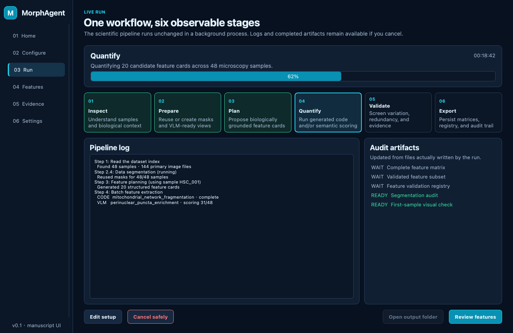
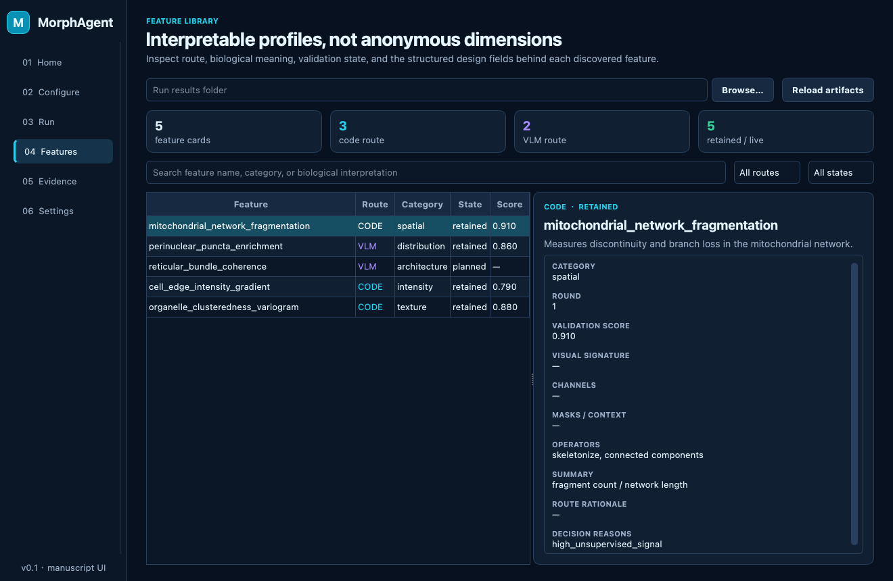

# MorphAgent graphical workflow

The graphical workspace is a guided front end for the repository's existing `main.py` pipeline. It is designed around the manuscript's real unit of work—a biologically grounded **feature card**—and its two quantification routes: executable code and VLM semantic scoring. It launches as a focused standalone Qt window by default, so unused napari layer controls and the empty viewer canvas do not consume screen space.

It does not replace or reimplement the scientific pipeline. The UI builds one explicit CLI command, runs it in a background process, streams its output, and reads the artifacts the pipeline actually writes.

## Install and launch

Prepare the main MorphAgent environment and API configuration first:

```bash
conda env create -f envs/environment.yml
conda activate morphagent
pip install -e ".[ui]"
python launch_ui.py  # automatically reads the repository .env
```

The default command opens only the MorphAgent interface and maximizes it to the current screen while retaining the operating-system title bar and window controls. napari remains an optional inspection mode and is also maximized when explicitly launched:

```bash
pip install -e ".[napari]"
python launch_ui.py --with-napari
```

Required entries in the repository-local `.env`:

- `LLM_BASE_URL`, `LLM_API_KEY`, and `LLM_MODEL` for planning, code generation/repair, and review.
- `VLM_BASE_URL`, `VLM_API_KEY`, and `VLM_MODEL` for online VLM scoring. The supplied file reuses the LLM values, so the user only fills one key.

`launch_ui.py` reads `.env` automatically and uses it as the UI's single API-configuration source, preventing stale shell exports from silently selecting another gateway. Keys are checked only for presence. They are never shown in the interface, appended to commands, or written to `ui_run_manifest.json`.

## Fastest safe first run

1. Open **Configure**.
2. Select **Load reference demo** to reproduce the bundled teacher workflow. It loads the five Tau-neuron samples, the supplied biological question, all three knowledge sources, existing masks, and the cached RAG summary.
3. For a different dataset, choose either:
   - a project root containing `dataset/`, `expert_knowledge/`, `deep_research/`, or `RAG/`; or
   - the dataset directory directly.
4. Select **Scan dataset**. The UI reports:
   - direct sample folders;
   - primary images available to generated code;
   - the image source that the VLM route would prefer;
   - existing masks under each sample's `segmentation/` directory;
   - empty or unusable sample folders.
5. Write the biological question. A strong prompt names the target object, phenotype/comparison, and spatial or resolution context.
6. Under **Mask preparation**, choose **Reuse existing masks** for the bundled demo or supplied masks; missing masks are created automatically. Choose **Regenerate Cellpose masks** only when the standard Cellpose mask trio should be recomputed for every sample and existing generated files may be overwritten; this generally requires a supported GPU.
7. Keep **Reference demo · both routes** for the bundled demo (two rounds × five candidates, target ten features) unless the question clearly requires only executable measurements or only semantic scoring.
   The UI always enables reproducible mode, so the generated command uses deterministic model settings and the fixed reproducibility seed without presenting another setup choice.
8. Resolve all red **BLOCK** checks. Yellow **CHECK** items disclose runtime/cost/safety decisions but do not prevent launch.
9. Inspect the exact command preview and select **Run complete workflow**.

The UI chooses a timestamped `results/run_ui_YYYYMMDD_HHMMSS/` directory and writes `ui_run_manifest.json` before launching the pipeline.

## Six observable stages

| UI stage | Existing pipeline boundary | User-visible evidence |
|---|---|---|
| Inspect | dataset indexing and dataset understanding | sample counts, log context |
| Prepare | knowledge, segmentation, first-sample visualization, VLM slice preparation | mask/visualization summaries |
| Plan | structured feature planning | `round_N/feature_plan.json` |
| Quantify | generated-code execution and/or VLM scoring | streamed feature/sample logs and cumulative CSV |
| Validate | dataset analysis and deterministic validation | retained/dropped states and registry |
| Export | round/final persistence | matrices, registry, round results, audit log |

The stage indicator is deliberately coarse because the legacy CLI does not yet emit structured progress events. The full console remains visible and is persisted to `ui_console.log`.

## Split feature and evidence review

The **Features** workspace keeps the searchable feature table on the left and the selected feature's biological interpretation and design fields on the right. Feature cards are loaded in this order:

1. `feature_registry.json` for cumulative lifecycle and validation state;
2. `round_N/feature_plan.json` for biological interpretation, visual signature, channel/mask needs, operators, statistics, and route rationale;
3. `retained_features.csv` or `features.csv` headers when richer audit files are unavailable.

The separate **Evidence** workspace uses two equal-width columns. The left column presents searchable, three-column feature-name buttons without horizontal scrolling; below them it repeats only the selected feature name and short biological description. Structured design fields remain on **Features**. The right column shows only evidence needed to understand the selected value and provenance: the selected matrix column, registry/validation decision, feature plan and round record, run manifest, segmentation summary, and available image context. Generated scripts, runtime logs, knowledge caches, and unrelated artifacts are excluded. Changing a feature selects and previews its first curated source instead of automatically jumping to an image.

For result-only debugging, **Load a previous run** on Home opens an existing run folder directly in Features and Evidence. This path never starts the pipeline or makes model calls.

The teacher demo produces shared first-sample overview images but no per-feature overlay. Evidence displays those images as run-level context and explicitly avoids calling them feature-specific heatmaps. VLM values remain semantic assessments, not calibrated physical measurements. Files can still be opened with the operating system, and supported images can be added as napari layers in `--with-napari` mode.

## Resume and cancellation

- **Cancel safely** sends a termination signal to the complete process group, escalates only if it does not exit, and preserves every artifact already written.
- **Resume a run** requires an explicit results directory containing at least one `round_N/round_results.json`. File existence alone is not treated as a completed round.
- A resumed run reconstructs the dataset/query/route from `ui_run_manifest.json` when present and delegates the actual resume behavior to `main.py --resume`.

## Safety and operational boundaries

- Generated feature code runs with the current user's permissions inside the configured Conda environment; that is dependency isolation, not an operating-system security sandbox. Use trusted inputs and review generated code/audit files.
- Preparation may create `slices/` and `segmentation/` under sample directories. Use writable, backed-up data.
- Automatic Cellpose-SAM preparation generally needs a supported GPU. Existing user masks can be reused.
- VLM work can be much more expensive than planning. Start with the bundled five-sample, ten-candidate reference workflow. Increase rounds, samples, or concurrency only by intentionally editing the documented low-frequency values in `.env`.
- A green process completion state means the CLI exited successfully; use **Features** and **Evidence** to audit invalid, dropped, or failed individual features and their run artifacts.
- A scientific end-to-end run still requires a complete MorphAgent environment, valid model endpoints/keys, a supported dataset, and sufficient compute. UI-only tests cannot establish biological validity.

## Troubleshooting

| Symptom | Action |
|---|---|
| Run button remains disabled | Read every **BLOCK** line; most commonly scan the dataset, add a question, select the MorphAgent Python, or complete the repository-local `.env` before launching the UI. |
| Code route has no primary images | Put raw images directly inside each sample folder, or choose VLM-only. |
| VLM preparation message appears | TIFF/stack inputs are valid, but the first round must generate PNG/JPEG 2D views. |
| Resume is blocked | Select the run directory itself and confirm it contains `round_N/round_results.json`. |
| Process exits unexpectedly | Open the output directory and inspect `ui_console.log`; completed artifacts remain usable. |
| The napari layer button is not shown | This is expected in the focused default window. Relaunch with `--with-napari` only when interactive layer inspection is needed. |
| napari mode opens but an artifact will not display | Open PNG/JPEG/TIFF images as layers; JSON/CSV/PDF artifacts should be opened with the operating system. |

## Visual identity

MorphAgent uses an ink/navy scientific workspace with aqua for executable measurements, violet for semantic scoring, coral for evidence, and green/yellow/red only for state. The original home artwork uses a diagonal wide-field-to-resolved transition with networks, bundles, puncta, and evidence callouts—visual motifs grounded in the manuscript's Cell Painting, HSC mitochondrial, and Tau/SIM applications rather than Nellie's branding.




